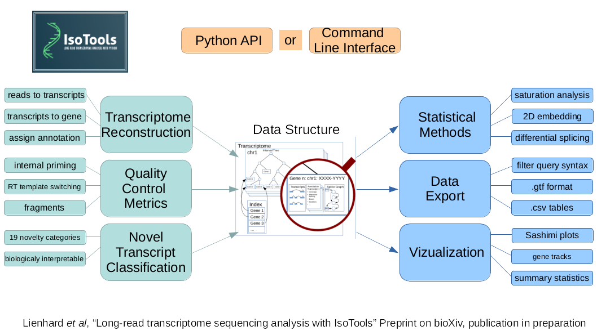

Getting Started
===============
IsoTools is a python module for Long Read Transcriptome Sequencing (LRTS) analysis.

Key features:

* Import of LRTS bam files (aligned full length transcripts).
* Import of reference annotation in gff3/gtf format.
* Computation of quality control metrics.
* Annotation and classification of novel transcripts using the biologically motivated classification scheme SQANTI.
* Evaluation of the coding potential of isoforms.
* Definition of alternative splicing events based on segment graphs.
* Detection of differential alternative splicing between samples and groups of samples.
* Gene modelling based on structural and expression variability.
* Support for proteogenomic approaches at the interface of transcriptomics and proteomics.
* Various data visualizations.

Installation
------------
The package can be installed with pip:

.. code-block:: bash

    python3 -m pip install isotools

Usage
-----
This code block demonstrates the basic file import with IsoTools.
For more comprehensive real world examples see the [tutorials](https://isotools.readthedocs.io/en/latest/tutorials.html "readthedocs").

.. code-block:: python

    from isotools import Transcriptome
    import logging
    logging.basicConfig(format='%(levelname)s:%(message)s', level=logging.INFO)
    transcriptome=Transcriptome.from_reference('reference_file.gff3.gz')
    isoseq_bam_fn={'sample1':'isoseq_fn_s1.bam', 'sample2':'isoseq_fn_s2.bam'}
    groups={'sample1':'control', 'sample2':'treatment'}
    for sa,bam in isoseq_bam_fn.items():
        transcriptome.add_sample_from_bam(bam, sample_name=sa, group=groups[sa])
    transcriptome.add_qc_metrics('genome.fa')
    transcriptome.make_index()
    transcriptome.add_filter()
    transcriptome.save('example_isotools.pkl')

Citation and feedback
---------------------
* If you run into any issues, please use the `github issues <https://github.com/HerwigLab/IsoTools2/issues>`_ report feature.
* For feedback, please write me an email to `yalan_bi@molgen.mpg.de <mailto:yalan_bi@molgen.mpg.de>`_ and `herwig@molgen.mpg.de <mailto:herwig@molgen.mpg.de>`_.
* If you use IsoTools in your publication, please cite the following paper in addition to this repository:
  * Lienhard, Matthias et al. “**IsoTools: a flexible workflow for long-read transcriptome sequencing analysis**.” Bioinformatics (Oxford, England) vol. 39,6 (2023): btad364. [doi:10.1093/bioinformatics/btad364](https://doi.org/10.1093/bioinformatics/btad364)
  * Bi, Yalan et al. “**IsoTools 2.0: Software for Comprehensive Analysis of Long-read Transcriptome Sequencing Data**.” Journal of molecular biology, 169049. 26 Feb. 2025, [doi:10.1016/j.jmb.2025.169049](https://doi.org/10.1016/j.jmb.2025.169049)
